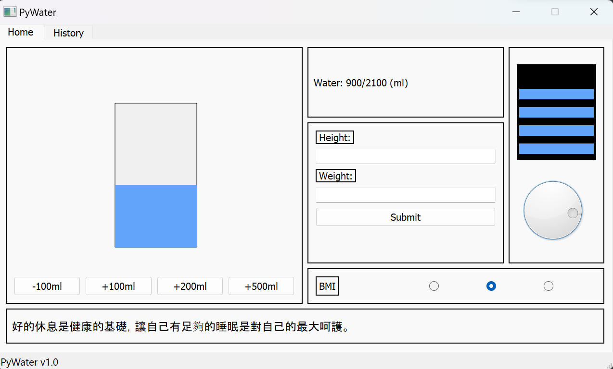
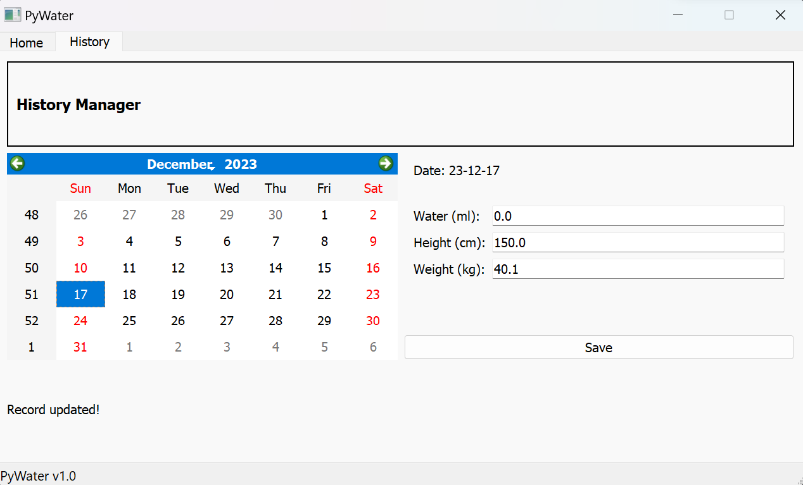

## pywater

Health management app with python pyqt5.

### Gallery

#### Home Page



#### History Page



### How to run it

```
$ git clone https://github.com/PinYu1618/pywater.git
$ cd pywater

# Then create virtual environment

# For linux:
$ python3 -m venv ./venv
$ source venv/bin/activate

# For windows:
python -m venv venv
venv\Scripts\activate

# Install dependencies

(venv) $ pip install -r requirements.txt

# Run it.
(venv) $ python main.py
```

*Important Note 1:*

After you **close** the app window, the process will **not** be terminated, because the background scheduler is still running. You can stop the it by typing `Ctrl+C` in your terminal or close the terminal. (It is because the window runs as a child process of notifier.)

*Important Note 2:*

To set the interval of notifications (in seconds), for example 3 secs

```
(venv) $ python main.py -interval 3  (or -i 3)
```

To disable the notification

```
(venv) $ python main.py --notify 0    (or -n 0)
```

### Folder Structure

```
pywater/
|_ db/                 # db csv files
|_ pywater/
|  |_ __init__.py      # allow pywater to be a package
|  |_ app.py           # main window app
|  |_ notify.py        # notifier setup
|  |_ pywater.py       # presenter class
|  |_ models/          # models
|  |_ views/           # ui
|_ tests/
|_ main.py
```

### LICENSE

GPL (required by package pyqt5)
